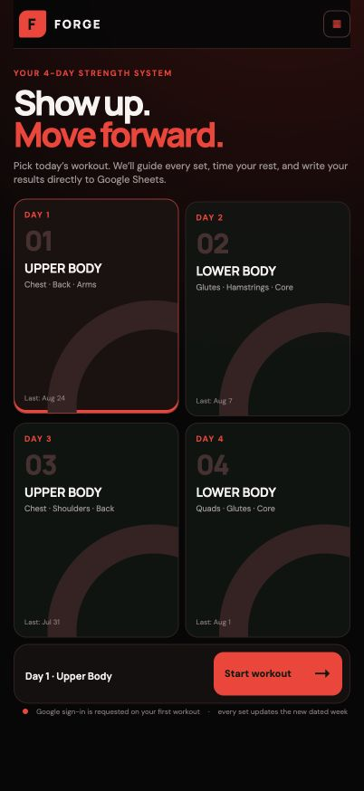
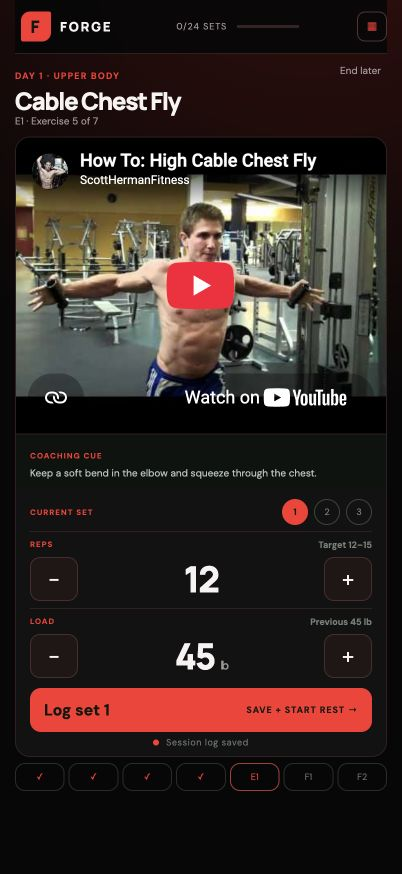

# Forge — Guided Workout Log

I built Forge because I was tired of opening a spreadsheet at the gym and typing every rep and weight into tiny cells. I wanted something that felt natural on my phone: choose the workout, follow each exercise, tap in the result, and keep moving.

Forge gives me that simpler experience without making me give up the workout history I already keep in Google Sheets. It also puts an exercise demo, a quick coaching cue, and a rest timer beside each set. When the workout is over, it compares the session with my previous performance and suggests how I can push a little further next time.

**Live site:** [Open Forge](https://forge-workout-log.z-hangtian.chatgpt.site)



## Why I made it

My spreadsheet was useful for storing data, but it was never designed to guide a workout. Logging sets interrupted the session, looking up exercise form meant switching apps, and the numbers did not tell me what to do next.

Forge turns that same information into a focused workout flow. Google Sheets stays in the background as my source of truth while the site handles the experience I actually want in the gym.

## What Forge does

- Guides approved users through a live seven-day Google Sheets program.
- Shows the private four-day strength and six-day glute programs only when the connected account is `zhanhangsky@gmail.com`; their Sheet IDs are delivered by an owner-guarded server endpoint and never embedded in the public client.
- Finds `Workout Monday` through `Workout Sunday` in Google Drive and reads each latest `Week N` tab dynamically.
- Starts sheet-driven sessions with the linked warm-up video, then shows each exercise’s linked YouTube demonstration and coaching cue.
- Records reps and load with large, phone-friendly controls, then saves cardio completion and session notes.
- Saves every set directly to the connected Google Sheet.
- Remembers an active workout so I can leave and continue later.
- Lets me revisit and correct sets I have already logged.
- Runs the appropriate rest timer after each set.
- Compares training volume with previous results.
- Suggests when to add weight, add a rep, or stay with the current load.



## How it works

1. Connect an approved Google account on this browser or device.
2. Pick a workout day loaded from that account's Google Drive.
3. Follow the exercise demo and coaching cue.
4. Log each set; Forge writes it to Google Sheets immediately.
5. Review the session summary and progression suggestion.

## Built with

- React and TypeScript
- vinext and Vite
- Cloudflare Workers and D1
- Drizzle ORM
- Google OAuth and the Google Sheets API
- OpenAI Sites hosting

## Run it locally

### Requirements

- Node.js 22.13 or newer
- A Google OAuth client with Google Sheets access

Install the dependencies and start the development site:

```bash
npm install
npm run dev
```

Forge expects these runtime values for its Google connection:

```text
GOOGLE_CLIENT_ID
GOOGLE_CLIENT_SECRET
GOOGLE_TOKEN_ENCRYPTION_KEY
ALLOWED_GOOGLE_EMAILS
```

The encryption key must be a base64-encoded AES key. `ALLOWED_GOOGLE_EMAILS` is a private, comma-separated list of exact email addresses; Forge denies all Google accounts when it is missing. The Google OAuth client also needs the app's `/api/google/callback` URL registered as an authorized redirect URI.

## Useful commands

```bash
npm run dev          # Start the local site
npm run build        # Create a production build
npm test             # Build and run the rendered-page tests
npm run lint         # Check the codebase
npm run db:generate  # Generate migrations after schema changes
```

## Privacy

Forge uses Google access only to identify an approved account and read or update its workout spreadsheets. Each browser connects separately using an HttpOnly device cookie; Google authorization tokens are encrypted in server-side storage and never placed in browser storage. See the [privacy policy](https://forge-workout-log.z-hangtian.chatgpt.site/privacy) for details.
